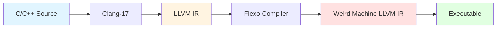
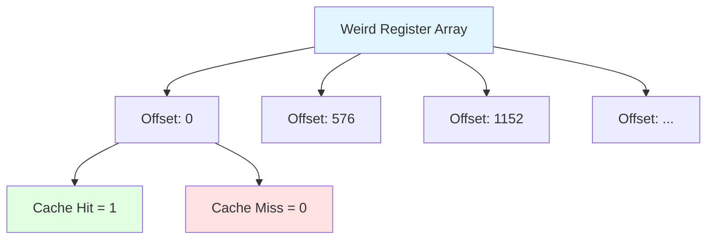
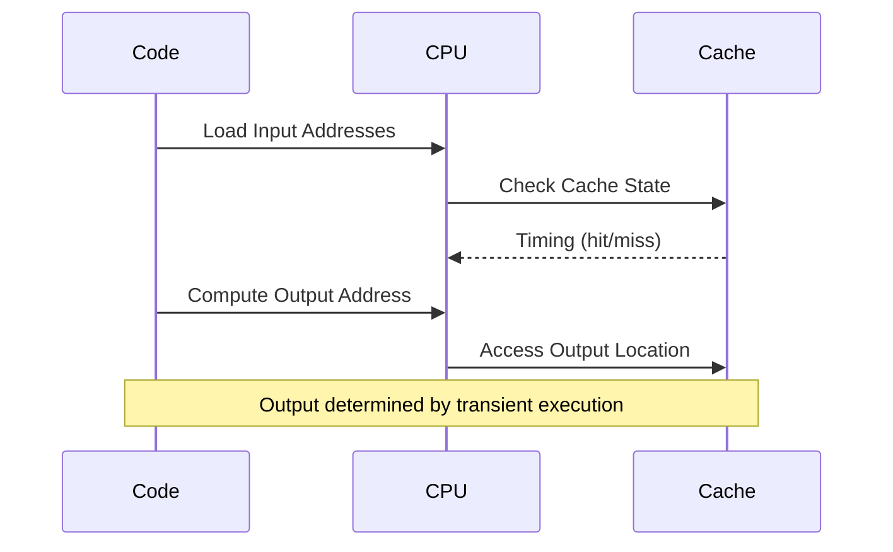

# 🎯 Flexo Demo: Microarchitectural Weird Machines

Welcome to the Flexo interactive demo! This guide will help you explore the fascinating world of microarchitectural weird machines (µWMs) - a novel approach to program obfuscation that operates purely through microarchitectural side effects.

## 📋 Executive Summary

**What is Flexo?**

Flexo is a revolutionary compiler that transforms ordinary code into "weird machines" - programs that perform computations using only microarchitectural side effects instead of traditional CPU instructions. This makes the code nearly impossible to analyze with debuggers or emulators, providing a powerful obfuscation technique.

**Key Benefits:**
- 🔒 **Strong Obfuscation**: Resists both static and dynamic analysis
- ⚡ **Practical Performance**: Execution times in microseconds
- 🎯 **Error Detection**: Built-in error detection for reliability
- 🔬 **Research-Backed**: Published at USENIX Security 2024

## 🏗️ Architecture Overview

### Compilation Pipeline



### How Weird Registers Work

Weird registers are memory locations that store values through cache timing side channels:



**How it works:**
1. A value of `1` is stored by bringing a memory address into cache
2. A value of `0` is stored by flushing the address from cache
3. Reading is done by measuring access latency (fast = cache hit = 1, slow = cache miss = 0)

### Weird Gate Execution



### The Transient Window Concept

```
Normal Execution:  ────────────────────────────
                   
Transient Window:       ╔═════╗
                        ║ ??? ║  ← Computation happens here!
                        ╚═════╝
                   
Exception/Fault:            ▼
```

The transient window is a brief period where the CPU executes instructions before an exception occurs. Flexo leverages this window to perform computations through microarchitectural side effects.

## 🔄 Flexo vs Traditional Obfuscation

| Feature | Traditional Obfuscation | Flexo Weird Machines |
|---------|------------------------|---------------------|
| **Analysis Resistance** | Moderate - Code structure visible | Strong - No visible computation |
| **Debugger Evasion** | Weak - Can be debugged | Strong - Single-stepping breaks execution |
| **Emulation Resistance** | Weak - Works in emulators | Strong - Requires real hardware |
| **Performance Overhead** | Low | Moderate (microseconds per gate) |
| **Error Detection** | Not built-in | Built-in error detection |
| **Reversibility** | Potentially reversible | Extremely difficult |
| **Use Cases** | General obfuscation | High-security obfuscation, packers |

## 💡 How an AND Gate Works

Let's break down how a simple AND gate works in Flexo:

### Traditional Code
```c
bool result = input1 & input2;
```

### Flexo Weird Machine
```c
bool __weird__and(bool in1, bool in2, bool& out) {
    out = in1 & in2;
    return out;  // error detection result
}
```

### Step-by-Step Execution

```
Step 1: Initialize Weird Registers
┌─────────────────────────────────────┐
│ Memory Layout:                      │
│ Addr[0]:    Input1 = 1 (cached)    │
│ Addr[576]:  Input2 = 1 (cached)    │
│ Addr[1152]: Output = ? (unknown)   │
└─────────────────────────────────────┘

Step 2: Compute Output Address
┌─────────────────────────────────────┐
│ Output_Addr = Base[Input1 + Input2]│
│             = Base[0 + 576]         │
│             = Base[576]             │
└─────────────────────────────────────┘

Step 3: Trigger Transient Execution
┌─────────────────────────────────────┐
│ Access memory at Output_Addr       │
│ Cache line at Addr[576] loaded     │
│ Exception occurs → transient done  │
└─────────────────────────────────────┘

Step 4: Read Result
┌─────────────────────────────────────┐
│ Measure latency at Result location │
│ Fast access → Cache HIT → Result=1 │
│ Slow access → Cache MISS → Result=0│
└─────────────────────────────────────┘
```

### Truth Table

```
Input1 | Input2 | Output | Expected | Result
-------|--------|--------|----------|--------
   0   |   0    |   0    |    0     |   ✓
   0   |   1    |   0    |    0     |   ✓
   1   |   0    |   0    |    0     |   ✓
   1   |   1    |   1    |    1     |   ✓
```

### ASCII Visualization

```
┌─────────┐
│  Input1 │──┐
└─────────┘  │
             ├──→ ┌─────────┐     ┌────────┐
┌─────────┐  │    │  AND    │────→│ Output │
│  Input2 │──┘    │  Gate   │     └────────┘
└─────────┘       └─────────┘
                       ↓
                  (via cache
                   side channel)
```

## 🚀 Quick Demo

Try running the basic gates demo:

```bash
# Using Docker
docker run -i -t --rm \
  --mount type=bind,source="$(pwd)"/,target=/flexo \
  flexo \
  bash /flexo/demo/interactive-demo.sh

# Or use individual demos
bash demo/examples/demo-gates.sh
```

## 📊 Example Circuits Available

| Circuit | Description | Gates | Complexity |
|---------|-------------|-------|------------|
| 🔲 **Logic Gates** | Basic AND, OR, NOT, XOR, MUX | 1 | Beginner |
| ➕ **Arithmetic** | Adders, Multipliers | 5-20 | Intermediate |
| 🧮 **4-bit ALU** | Complete arithmetic logic unit | 50+ | Advanced |
| 🔐 **AES** | AES block cipher encryption | 1000+ | Expert |
| 🔒 **SHA-1** | SHA-1 hash function | 500+ | Expert |
| 🔑 **Simon** | Simon block cipher | 800+ | Expert |

## 📚 Documentation Structure

- **[QUICKSTART.md](docs/QUICKSTART.md)** - Get started in 5 minutes
- **[EXAMPLES.md](docs/EXAMPLES.md)** - Detailed circuit examples
- **[BENCHMARKS.md](docs/BENCHMARKS.md)** - Performance metrics
- **[ARCHITECTURE.md](docs/ARCHITECTURE.md)** - Deep dive into internals

## 🎓 Research & Papers

This work was published at **USENIX Security 2024**:

> Ping-Lun Wang, Riccardo Paccagnella, Riad S. Wahby, Fraser Brown.  
> **"Bending microarchitectural weird machines towards practicality."**  
> USENIX Security Symposium, 2024.

**Key Contributions:**
- Novel weird register designs (Baseline, NoBranch, Dual)
- Practical compiler implementation with LLVM
- Demonstration of complex circuits (AES, SHA-1)
- Real-world application (UPFlexo packer)

## 🔬 Supported Hardware

Flexo has been tested on:

| Vendor | Microarchitecture | Instance Type | Processor |
|--------|------------------|---------------|-----------|
| 🔴 AMD | Zen 1 | t3a.xlarge | EPYC 7571 |
| 🔴 AMD | Zen 2 | c5a.xlarge | EPYC 7R32 |
| 🔴 AMD | Zen 3 | c6a.xlarge | EPYC 7R13 |
| 🔴 AMD | Zen 4 | m7a.xlarge | EPYC 9R14 |
| 🔵 Intel | Skylake | c5n.xlarge | Xeon 8124M |
| 🔵 Intel | Cascade Lake | m5n.xlarge | Xeon 8259CL |
| 🔵 Intel | Icelake | m6in.xlarge | Xeon 8375C |
| 🔵 Intel | Sapphire Rapids | m7i.xlarge | Xeon 8488C |

## 🎯 Next Steps

1. **Try the Quick Start**: [docs/QUICKSTART.md](docs/QUICKSTART.md)
2. **Run Interactive Demo**: `bash demo/interactive-demo.sh`
3. **Explore Examples**: Check out `circuits/` directory
4. **Build Something**: Follow the developer guide

## 💬 Contact & Contributing

For questions or contributions:
- **Author**: Ping-Lun Wang (pinglunw [at] andrew [dot] cmu [dot] edu)
- **Issues**: Open an issue on GitHub
- **Pull Requests**: Contributions welcome!

---

**Ready to explore weird machines?** Start with the [Quick Start Guide](docs/QUICKSTART.md)! 🚀
