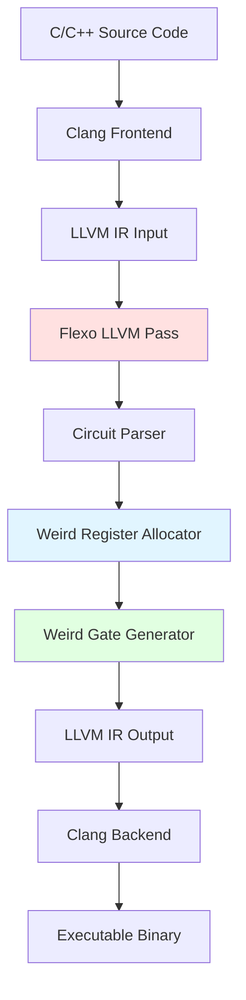

# 🏗️ Flexo Architecture Documentation

Deep dive into the internal architecture, compiler design, and implementation details of Flexo.

## Table of Contents

1. [System Overview](#-system-overview)
2. [Compiler Pipeline](#-compiler-pipeline)
3. [Weird Register Types](#-weird-register-types)
4. [Weird Gate Mechanisms](#-weird-gate-mechanisms)
5. [LLVM Pass Implementation](#-llvm-pass-implementation)
6. [Circuit Generation](#-circuit-generation)
7. [Runtime Behavior](#-runtime-behavior)
8. [Configuration System](#-configuration-system)
9. [Error Detection](#-error-detection)
10. [Contributing Guidelines](#-contributing-guidelines)

---

## 🎯 System Overview

### High-Level Architecture



### Component Responsibilities

| Component | Purpose | Location |
|-----------|---------|----------|
| **Circuit Parser** | Converts LLVM IR to circuit representation | `lib/Circuits/IRParser.cpp` |
| **Weird Register Allocator** | Allocates memory locations for weird registers | `lib/WeirdRegisters/` |
| **Weird Gate Generator** | Generates code for weird gates | `lib/WeirdMachine/` |
| **Configuration Manager** | Handles environment variables | `include/Config.h` |
| **Verilog Support** | Structural Verilog parsing (optional) | `lib/Circuits/VerilogParser.cpp` |

---

## 🔄 Compiler Pipeline

### Stage 1: LLVM IR Parsing

```
Input LLVM IR Function:
┌─────────────────────────────────────┐
│ define bool @__weird__and(          │
│     i1 %in1, i1 %in2, i1* %out      │
│ ) {                                 │
│ entry:                              │
│   %result = and i1 %in1, %in2       │
│   store i1 %result, i1* %out        │
│   ret i1 false                      │
│ }                                   │
└─────────────────────────────────────┘
```

**Parser Actions:**
1. Identify functions with `WM_KEYWORD` (default: `__weird__`)
2. Extract inputs (read variables)
3. Extract outputs (written variables)
4. Build internal circuit representation

### Stage 2: Circuit Representation

```cpp
// Internal circuit structure
struct Circuit {
    std::vector<Wire> inputs;      // Input wires
    std::vector<Wire> outputs;     // Output wires
    std::vector<Gate> gates;       // Logic gates
    std::map<Wire, Value*> mapping; // Wire to LLVM value
};

struct Gate {
    GateType type;                 // AND, OR, NOT, XOR, etc.
    std::vector<Wire> inputs;      // Input wire indices
    Wire output;                   // Output wire index
};
```

**Example Circuit Graph:**
```
Wire 0 (in1) ────┐
                 ├──→ Gate 0 (AND) ──→ Wire 2 (result)
Wire 1 (in2) ────┘
```

### Stage 3: Weird Register Allocation

```
Memory Layout (WR_OFFSET=576):

Address Space:
┌─────────────────────────────────────────────┐
│ Base + 0:      Wire 0 (Real/Fake locations) │
│ Base + 576:    Wire 1 (Real/Fake locations) │
│ Base + 1152:   Wire 2 (Real/Fake locations) │
│ Base + 1728:   Wire 3 (Real/Fake locations) │
│ ...                                          │
└─────────────────────────────────────────────┘

Each weird register has:
- Real location (actual value)
- Fake location (WR_FAKE_OFFSET away)
```

### Stage 4: Code Generation

```llvm
; Generated LLVM IR for weird gate execution
; Simplified example

; Setup phase - initialize weird registers
call void @wr_init(i8* %base, i32 %num_wires)

; Set input values
call void @wr_set(i8* %base, i32 0, i1 %in1)    ; Wire 0 = in1
call void @wr_set(i8* %base, i32 1, i1 %in2)    ; Wire 1 = in2

; Execute weird gate
call void @execute_weird_gate(
    i8* %base,
    i32* %inputs,      ; [0, 1] - wire indices
    i32 %output,       ; 2 - output wire index
    i32 %gate_type     ; AND
)

; Read result
%result = call i1 @wr_get(i8* %base, i32 2)
%error = call i1 @wr_error(i8* %base, i32 2)
```

### Stage 5: Optimization

The compiler performs several optimizations:

1. **Gate Merging**: Combines compatible gates
2. **Dead Wire Elimination**: Removes unused wires
3. **Fanout Optimization**: Limits wire fanout (WM_MAX_FANOUT)
4. **Gate Sizing**: Controls gate complexity (DUAL_WM_MAX_INPUT)

---

## 🔢 Weird Register Types

Flexo supports three weird register implementations, controlled by `WR_TYPE`:

### 1. Baseline Weird Registers

**Mechanism**: Simple cache-based encoding

```cpp
// Set value to 1: Bring address into cache
void wr_set_baseline(uint8_t* addr, bool value) {
    if (value) {
        // Cache the address
        volatile uint8_t tmp = *addr;
    } else {
        // Flush from cache
        clflush(addr);
    }
}

// Get value: Measure access time
bool wr_get_baseline(uint8_t* addr) {
    uint64_t start = rdtsc();
    volatile uint8_t tmp = *addr;
    uint64_t end = rdtsc();
    
    // Fast = cache hit = 1, Slow = miss = 0
    return (end - start) < WR_HIT_THRESHOLD;
}
```

**Properties:**
- ✅ Simple implementation
- ✅ Easy to understand
- ⚠️ Susceptible to branch prediction effects
- ⚠️ Moderate accuracy (~87%)

### 2. NoBranch Weird Registers

**Mechanism**: Branch-free implementation using arithmetic

```cpp
// Set without branches
void wr_set_nobranch(uint8_t* addr_real, uint8_t* addr_fake, bool value) {
    // Compute target: value ? real : fake
    uint8_t* target = addr_real + (value ? 0 : WR_FAKE_OFFSET);
    volatile uint8_t tmp = *target;  // Cache target
    
    // Flush the other one
    uint8_t* other = addr_real + (value ? WR_FAKE_OFFSET : 0);
    clflush(other);
}

// Get without branches
bool wr_get_nobranch(uint8_t* addr_real, uint8_t* addr_fake) {
    uint64_t t1 = time_access(addr_real);
    uint64_t t2 = time_access(addr_fake);
    
    // Use arithmetic instead of comparison
    int diff = (int)t1 - (int)t2;
    return (diff < 0);  // real faster than fake = 1
}
```

**Properties:**
- ✅ Eliminates branch prediction issues
- ✅ Better accuracy (~91%)
- ⚠️ Requires two memory locations per wire
- ⚠️ More complex implementation

### 3. Dual Weird Registers (Recommended)

**Mechanism**: Combines two complementary encodings

```cpp
struct DualWR {
    uint8_t* addr_pos;  // Positive encoding
    uint8_t* addr_neg;  // Negative encoding
};

// Set with dual encoding
void wr_set_dual(DualWR* wr, bool value) {
    if (value) {
        // Value = 1: pos cached, neg flushed
        volatile uint8_t tmp = *wr->addr_pos;
        clflush(wr->addr_neg);
    } else {
        // Value = 0: pos flushed, neg cached
        clflush(wr->addr_pos);
        volatile uint8_t tmp = *wr->addr_neg;
    }
}

// Get with dual verification
bool wr_get_dual(DualWR* wr, bool* error) {
    uint64_t t_pos = time_access(wr->addr_pos);
    uint64_t t_neg = time_access(wr->addr_neg);
    
    bool pos_hit = (t_pos < WR_HIT_THRESHOLD);
    bool neg_hit = (t_neg < WR_HIT_THRESHOLD);
    
    // Error detection: both hit or both miss
    *error = (pos_hit == neg_hit);
    
    return pos_hit;  // Use positive encoding as result
}
```

**Properties:**
- ✅ Built-in error detection
- ✅ Highest accuracy (~95%)
- ✅ Most robust design
- ⚠️ Uses 2x memory per wire
- ⚠️ Slightly slower than baseline

### Comparison Table

| Feature | Baseline | NoBranch | Dual |
|---------|----------|----------|------|
| **Accuracy** | ~87% | ~91% | ~95% |
| **Speed** | Fast | Medium | Medium |
| **Memory/Wire** | 1x | 2x | 2x |
| **Error Detection** | No | No | **Yes** |
| **Branch-Free** | No | Yes | Partial |
| **Complexity** | Low | Medium | High |
| **Recommended** | Debug | Balanced | **Production** |

---

## ⚡ Weird Gate Mechanisms

### Transient Execution Window

Flexo leverages transient execution caused by divide-by-zero:

```cpp
void execute_weird_gate(
    uint8_t* base,
    uint32_t* inputs,
    uint32_t output,
    GateType type
) {
    // 1. Compute output address based on inputs
    uint64_t addr = compute_output_address(base, inputs, type);
    
    // 2. Create transient window via divide-by-zero
    volatile uint32_t divisor = 0;
    for (int i = 0; i < RET_WM_DIV_ROUNDS; i++) {
        uint64_t dummy = some_value / divisor;  // Exception!
    }
    
    // 3. During transient execution, access output location
    //    This runs speculatively before exception is handled
    volatile uint8_t tmp = *(uint8_t*)addr;
    
    // 4. Exception caught, but cache side effect remains
    // 5. Output wire now has correct cache state
}
```

**Transient Window Timeline:**

```
Time  ──────────────────────────────────────────►

Instruction Flow:
     ┌──────────┐ ┌──────────────┐ ┌─────────┐
     │  Setup   │ │   Transient  │ │Exception│
     │  Inputs  │ │   Execution  │ │ Handler │
     └──────────┘ └──────────────┘ └─────────┘
                       ▲
                       │
              Weird gate computation
              happens here via
              cache side effects
```

### Gate Type Implementations

#### AND Gate

```
Output Address Calculation:
addr = base[input1_offset + input2_offset]

Truth Table (cache perspective):
in1 in2 | Offset Accessed | Cache State
--------|-----------------|-------------
 0   0  | base[0]         | Miss (0)
 0   1  | base[576]       | Miss (0)
 1   0  | base[576]       | Miss (0)
 1   1  | base[1152]      | Hit (1)
```

#### OR Gate

```
addr = base[input1_offset + input2_offset + k]

// Offset adjustment ensures:
// - (0,0) → miss
// - (0,1), (1,0), (1,1) → hit
```

#### NOT Gate

```
addr = base[NOT_BASE + (input ? 0 : WR_OFFSET)]

// Inverts the cache state
```

#### XOR Gate (Multiple Inputs)

```
addr = base[xor_table[input1][input2][input3]...]

// Uses precomputed lookup table for complex XOR
```

---

## 🔧 LLVM Pass Implementation

### Pass Structure

```cpp
// lib/FlexoPass.cpp (simplified)

class FlexoPass : public PassInfoMixin<FlexoPass> {
public:
    PreservedAnalyses run(Module &M, ModuleAnalysisManager &MAM) {
        // 1. Find weird functions
        for (Function &F : M) {
            if (isWeirdFunction(F)) {
                processWeirdFunction(F);
            }
        }
        return PreservedAnalyses::none();
    }

private:
    void processWeirdFunction(Function &F) {
        // 2. Parse to circuit
        Circuit circuit = parseToCircuit(F);
        
        // 3. Allocate weird registers
        WRAllocator allocator(circuit);
        allocator.allocate();
        
        // 4. Generate weird machine code
        WMGenerator generator(circuit, allocator);
        generator.generate(F);
        
        // 5. Replace original function body
        replaceFunction(F, generator.getNewBody());
    }
};
```

### Supported LLVM IR Instructions

**Arithmetic:**
- `add`, `sub`, `mul`, `udiv`, `sdiv`, `urem`, `srem`

**Logical:**
- `and`, `or`, `xor`, `shl`, `lshr`, `ashr`

**Comparison:**
- `icmp eq`, `icmp ne`, `icmp ugt`, `icmp uge`, `icmp ult`, `icmp ule`
- `icmp sgt`, `icmp sge`, `icmp slt`, `icmp sle`

**Selection:**
- `select`

**Bitwise:**
- `trunc`, `zext`, `sext`

**NOT Supported:**
- Branches (`br`)
- Function calls (`call`)
- Memory operations (except input/output parameters)
- Pointers (except for passing inputs/outputs)
- Floating point operations

### Extension Points

To add support for new instructions:

```cpp
// lib/Circuits/IRParser.cpp

void IRParser::visitNewInstruction(NewInstruction *I) {
    // 1. Create gate in circuit
    Gate gate;
    gate.type = GATE_NEW_TYPE;
    
    // 2. Map operands to wires
    gate.inputs.push_back(getWire(I->getOperand(0)));
    gate.inputs.push_back(getWire(I->getOperand(1)));
    
    // 3. Create output wire
    gate.output = createWire(I);
    
    // 4. Add to circuit
    circuit.gates.push_back(gate);
}
```

---

## 🔨 Circuit Generation

### From C/C++ Source

```cpp
// User writes:
bool __weird__example(int a, int b, int* result) {
    *result = (a + b) * 2;
    return false;
}

// Compiler generates circuit:
Circuit {
    Inputs: [Wire0: a, Wire1: b]
    Gates: [
        Gate0: ADD(Wire0, Wire1) → Wire2
        Gate1: MUL(Wire2, Const2) → Wire3
    ]
    Outputs: [Wire3: result]
}
```

### From Structural Verilog

```verilog
// User writes Verilog:
module example(
    input [3:0] a,
    input [3:0] b,
    output [4:0] sum
);
    assign sum = a + b;
endmodule

// Compiler parses and generates equivalent circuit
```

To use Verilog input:

```bash
export WM_CIRCUIT_FILE=path/to/circuit.v
./compile.sh input.ll output-wm.ll
```

---

## 🏃 Runtime Behavior

### Initialization Phase

```cpp
// Generated at function start
void weird_function_init() {
    // 1. Allocate memory for weird registers
    uint8_t* wr_base;
    if (WR_USE_MMAP) {
        wr_base = mmap(NULL, total_size, PROT_READ|PROT_WRITE, 
                       MAP_PRIVATE|MAP_ANONYMOUS, -1, 0);
    } else {
        wr_base = alloca(total_size);  // Stack allocation
    }
    
    // 2. Initialize random number generator
    if (WR_SYSCALL_RAND) {
        syscall(SYS_getrandom, &seed, sizeof(seed), 0);
    } else {
        seed = rand();
    }
    
    // 3. Flush all weird register locations
    for (int i = 0; i < num_wires; i++) {
        clflush(wr_base + i * WR_OFFSET);
        if (WR_TYPE == Dual) {
            clflush(wr_base + i * WR_OFFSET + WR_FAKE_OFFSET);
        }
    }
}
```

### Execution Phase

```cpp
// For each gate in circuit
for (Gate gate : circuit.gates) {
    // 1. Read inputs (if not already cached from previous gate)
    for (Wire input : gate.inputs) {
        input_values.push_back(wr_get(base, input));
    }
    
    // 2. Execute weird gate
    execute_weird_gate(base, gate);
    
    // 3. Optional delay or fence
    if (WM_USE_FENCE) {
        mfence();
    } else {
        for (int i = 0; i < WM_DELAY; i++) {
            asm volatile("nop");
        }
    }
}
```

### Cleanup Phase

```cpp
// Generated at function end
void weird_function_cleanup() {
    // 1. Read all outputs
    for (Wire output : circuit.outputs) {
        bool value = wr_get(base, output);
        bool error = wr_error(base, output);
        store_output(value, error);
    }
    
    // 2. Free memory if mmap was used
    if (WR_USE_MMAP) {
        munmap(wr_base, total_size);
    }
    // Stack allocation freed automatically
}
```

---

## ⚙️ Configuration System

### Environment Variable Processing

```cpp
// include/Config.h

class Config {
public:
    static Config& instance() {
        static Config config;
        return config;
    }
    
    // General settings
    std::string wm_keyword;        // WM_KEYWORD
    bool verbose;                  // WM_VERBOSE
    std::string tmp_path;          // TMP_PATH
    std::string circuit_file;      // WM_CIRCUIT_FILE
    
    // Weird machine settings
    uint32_t wm_delay;             // WM_DELAY
    bool wm_use_fence;             // WM_USE_FENCE
    uint32_t ret_wm_div_rounds;    // RET_WM_DIV_ROUNDS
    uint32_t ret_wm_div_size;      // RET_WM_DIV_SIZE
    uint32_t ret_wm_jmp_size;      // RET_WM_JMP_SIZE
    uint32_t dual_wm_max_input;    // DUAL_WM_MAX_INPUT
    uint32_t wm_max_fanout;        // WM_MAX_FANOUT
    
    // Weird register settings
    WRType wr_type;                // WR_TYPE
    WRMapping wr_mapping;          // WR_MAPPING
    uint32_t wr_offset;            // WR_OFFSET
    uint32_t wr_fake_offset;       // WR_FAKE_OFFSET
    uint32_t wr_hit_threshold;     // WR_HIT_THRESHOLD
    bool wr_syscall_rand;          // WR_SYSCALL_RAND
    bool wr_use_mmap;              // WR_USE_MMAP

private:
    Config() {
        loadFromEnvironment();
    }
    
    void loadFromEnvironment() {
        wm_keyword = getenv_or("WM_KEYWORD", "__weird__");
        verbose = getenv_bool("WM_VERBOSE", false);
        wm_delay = getenv_uint("WM_DELAY", 256);
        // ... load all settings
    }
};
```

### Configuration Validation

```cpp
void Config::validate() {
    // Check for conflicts
    if (wm_use_fence && wm_delay > 0) {
        warn("Both WM_USE_FENCE and WM_DELAY set; fence takes precedence");
    }
    
    // Check for invalid values
    if (wr_offset < 64) {
        error("WR_OFFSET too small; minimum is 64 bytes");
    }
    
    if (ret_wm_div_rounds < 1 || ret_wm_div_rounds > 50) {
        warn("RET_WM_DIV_ROUNDS outside recommended range [1-50]");
    }
}
```

---

## 🛡️ Error Detection

### Dual Weird Register Error Detection

```cpp
struct WRError {
    bool detected;     // Was an error detected?
    uint32_t wire;     // Which wire had the error?
    bool expected;     // Expected value (if known)
    bool actual;       // Actual value read
};

bool check_output(uint8_t* base, uint32_t wire, bool* value) {
    if (WR_TYPE == Dual) {
        uint64_t t_pos = time_access(base + wire * WR_OFFSET);
        uint64_t t_neg = time_access(base + wire * WR_OFFSET + WR_FAKE_OFFSET);
        
        bool pos_hit = (t_pos < WR_HIT_THRESHOLD);
        bool neg_hit = (t_neg < WR_HIT_THRESHOLD);
        
        if (pos_hit == neg_hit) {
            // Both hit or both miss = error!
            return true;  // Error detected
        }
        
        *value = pos_hit;
        return false;  // No error
    } else {
        // Baseline and NoBranch don't have built-in error detection
        *value = wr_get(base, wire);
        return false;
    }
}
```

### Error Handling Strategies

**Strategy 1: Retry on Error**
```cpp
bool result;
bool error;
int attempts = 0;

do {
    error = __weird__function(inputs, &result);
    attempts++;
} while (error && attempts < MAX_RETRIES);

if (error) {
    // Fallback to traditional computation
    result = traditional_function(inputs);
}
```

**Strategy 2: Majority Voting**
```cpp
const int N = 5;
bool results[N];
bool errors[N];

for (int i = 0; i < N; i++) {
    errors[i] = __weird__function(inputs, &results[i]);
}

// Use majority of non-error results
bool final_result = majority_vote(results, errors, N);
```

**Strategy 3: Accept Error Rate**
```cpp
// For non-critical operations, simply use the result
// Error rate of 2-5% may be acceptable depending on application
bool result;
__weird__function(inputs, &result);
// Use result even if errors occurred
```

---

## 🤝 Contributing Guidelines

### Setting Up Development Environment

```bash
# 1. Clone repository
git clone https://github.com/AYUSHMIT/Flexo.git
cd Flexo

# 2. Build in debug mode
docker build -t flexo-dev -f Dockerfile.dev .
docker run -it --rm \
  --mount type=bind,source="$(pwd)"/,target=/flexo \
  flexo-dev

# 3. Build with debug symbols
cmake -DLT_LLVM_INSTALL_DIR=/usr/lib/llvm-17 \
      -DCMAKE_BUILD_TYPE=Debug \
      -G Ninja -B build -S .
ninja -C build
```

### Code Structure

```
Flexo/
├── include/
│   ├── Config.h              # Configuration management
│   ├── Circuits/             # Circuit representation
│   │   ├── Circuit.h
│   │   ├── IRParser.h
│   │   └── VerilogParser.h
│   ├── WeirdRegisters/       # WR implementations
│   │   ├── WRAllocator.h
│   │   └── WRTypes.h
│   └── WeirdMachine/         # WM generation
│       ├── WMGenerator.h
│       └── GateTypes.h
├── lib/
│   ├── FlexoPass.cpp         # Main LLVM pass
│   ├── Circuits/             # Circuit implementation
│   ├── WeirdRegisters/       # WR implementation
│   └── WeirdMachine/         # WM implementation
└── circuits/                 # Example circuits
```

### Adding New Gate Types

```cpp
// 1. Define gate type in include/WeirdMachine/GateTypes.h
enum class GateType {
    AND, OR, NOT, XOR,
    MY_NEW_GATE,  // Add here
};

// 2. Implement gate in lib/WeirdMachine/Gates.cpp
void generate_my_new_gate(
    IRBuilder<>& builder,
    WRAllocator& allocator,
    Gate& gate
) {
    // Generate LLVM IR for the gate
    // ...
}

// 3. Register gate in lib/WeirdMachine/WMGenerator.cpp
void WMGenerator::generateGate(Gate& gate) {
    switch (gate.type) {
        // ...
        case GateType::MY_NEW_GATE:
            generate_my_new_gate(builder, allocator, gate);
            break;
    }
}

// 4. Add parser support in lib/Circuits/IRParser.cpp
void IRParser::visitMyNewInstruction(MyNewInstruction* I) {
    Gate gate;
    gate.type = GateType::MY_NEW_GATE;
    // ... parse operands
    circuit.gates.push_back(gate);
}
```

### Testing New Features

```bash
# 1. Create test circuit
cat > test/my_test.cpp << EOF
bool __weird__my_test(bool in, bool& out) {
    out = my_new_operation(in);
    return false;
}
EOF

# 2. Compile
make -C test/
./compile.sh test/my_test.ll test/my_test-wm.ll

# 3. Run
clang-17 test/my_test-wm.ll -o test/my_test.elf -lm -lstdc++
./test/my_test.elf

# 4. Verify output
# Expected accuracy > 70%
```

### Pull Request Checklist

- [ ] Code follows existing style guidelines
- [ ] All new functions have documentation comments
- [ ] Configuration options documented in README
- [ ] Test cases added for new features
- [ ] Existing tests still pass
- [ ] Performance benchmarks included (if applicable)
- [ ] Example circuits updated (if applicable)

### Code Style

```cpp
// Use CamelCase for classes
class MyNewClass {
public:
    // Use camelCase for methods
    void myMethod();
    
private:
    // Use snake_case for member variables
    uint32_t my_member_var_;
};

// Use snake_case for functions
void my_helper_function() {
    // 4-space indentation
    if (condition) {
        do_something();
    }
}
```

### Debugging Tips

```cpp
// Enable verbose output
export WM_VERBOSE=true

// Add debug prints
#include <iostream>
std::cerr << "[DEBUG] Wire " << wire_id << " = " << value << std::endl;

// Use LLVM debug output
opt-17 -debug -load-pass-plugin ./build/lib/libFlexo.so \
    -passes="create-WMs" input.ll -S -o output.ll 2>&1 | less

// GDB debugging
gdb --args opt-17 -load-pass-plugin ./build/lib/libFlexo.so \
    -passes="create-WMs" input.ll -S -o output.ll
```

---

## 📚 Additional Resources

### Academic Papers

1. **Main Paper**: "Bending microarchitectural weird machines towards practicality"  
   - USENIX Security 2024
   - Explains the theory and design of Flexo

2. **Related Work**: Spectre, Meltdown, and transient execution attacks  
   - Background on microarchitectural side channels

### Useful Links

- **LLVM Documentation**: https://llvm.org/docs/
- **Pass Writing**: https://llvm.org/docs/WritingAnLLVMPass.html
- **CMake**: https://cmake.org/documentation/

### Community

- **Issues**: Report bugs or request features on GitHub
- **Discussions**: Ask questions in GitHub Discussions
- **Email**: Contact the authors for research collaboration

---

**Ready to contribute?** Start by exploring the codebase and trying to add a simple gate type!
